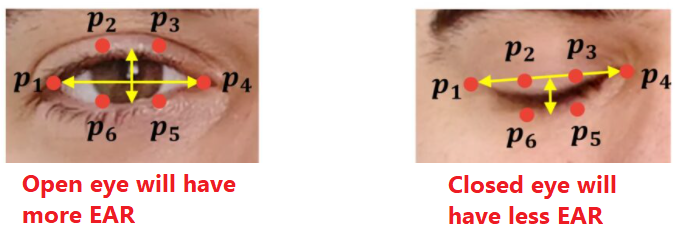
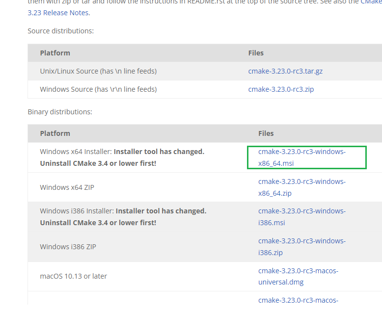
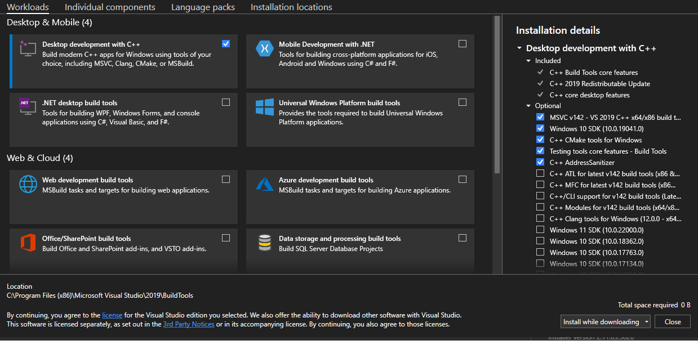

<H1 align="center">
    Are You Blinking?
</H1>

<H5 align="center">
    A blink detection algorithm that can categorize blink duration and translate the Morse Code in real-time.
</H5>

add gif here

# Introduction

Are you taken hostage by a dictator and have no way of communicating with the outside world? Did your kidnappers also coincidentally decide to release a video of you to ask for ransom? 

Fret not! I have you covered 🤝. Just blink away your secret message in Morse Code and this program will take care of the rest.


# What does this program do?

This algorithm can take any recorded video (or, even live camera feed!) and translate the blinks into Morse Code, and then to English in real time. That means, you can send an SOS signal or even the location of those cruel perpetrators to the police. 


# Implementation

This algorithm is inspired from Adrian Rosebrock from pyimagesearch, be sure to check him out for a more in depth guide and more blog posts like this project. 


To detect the eye blinks from a video, this program considers the *Eye Aspect Ratio*, which is defined as:

<p align="center">
  
</p>

These points p1 ... p6 refer to facial landmarks associated with the eye as follows: 

<p align="center">
  
</p>

As one can see, when you consider the EAR, it rapidly decreases when your eyes are closed and stays approximately around a reasonable threshold when open. We use this threshold to determine if your eye has blinked or not.

Once your eye has blinked we have to, in order: 

* Determine and categorize the duration of the blink
* Use the category to compute if it is a dash (-) or a dot (.)
* Build the Morse Code message and translate it 

We do this using `time.time()` to measure how long it takes for each blink. Once we can figure that out, we seperate them into short blinks and long blinks, and dots and dashes respectively. After that we dynamically build a `string` that stores the encoded secret message. Finally we using a dictionary to decode the string and output that in the terminal.

# Getting Started

There are some pre-requisites before getting started. I will list the versions I tested on:

1. Python (3.8.3)
2. imutils (0.5.4)
3. opencv-python (4.3.0.36)
4. dlib (19.23.1)

### Dlib installation

All packages except dlib are pretty straightforward. If you do not have them you can just run ```pip install [package-name]"``` in your promopt (Anaconda prompt or cmd, wherever you can run `pip`) without the square brackets for any package. However, dlib requires a little... convincing. It is because dlib is a C++ library that employs machine learning, linear algebra and computer vision to perform numerical operations efficiently and portably. I will go over how to install dlib on Windows 10/11. The prequesites are:

<details> 
  <summary> CMake </summary>    
    Dlib is written in C/C++, and your computer needs to *build* the package, so you need something that can automate that build process. Head over here and download the file that is the best for you. I recommend the .msi file since it is much easier (tip - make sure to add the Windows PATH during installation). :
    
<p align="center">
  
</p>
    
</details>


<details>
    <summary>Visual Studio</summary>
    This one can be a little tricky. While Visual Studio is a great tool that functions as a compiler for the C based packages/libraries, what we really need is the C++ CMake tools for Windows option that is provided as an optional addition when you install Visual Studio. Head over here to download it. Once you are on the screen where you can select the different modules to download, you can refer to this image to make sure you are downloading the right tools for this program:
    
<p align="center">
  
</p>
</details>

Now you can run the following codes and all should work fine.

```
pip install cmake
pip install dlib
```

This might take some time. I suggest going out for a walk and touching grass. After it is compiled, try `pip show dlib` to check if it has downloaded and compiled correctly. If you have any errors building the wheel, you might have not downloaded CMake or VS correctly, or you might have conflicts with versions. If so, try the steps again and try installing cmake and dlib on a virtual environment. 


Now that we have all the prequesites ready, you can download my source code and open the Anaconda Prompt (or any terminal of your choice) and run the respective commands given in `commands.txt`. If you have a local video, you can pass the path of the file as an argument in the command.
